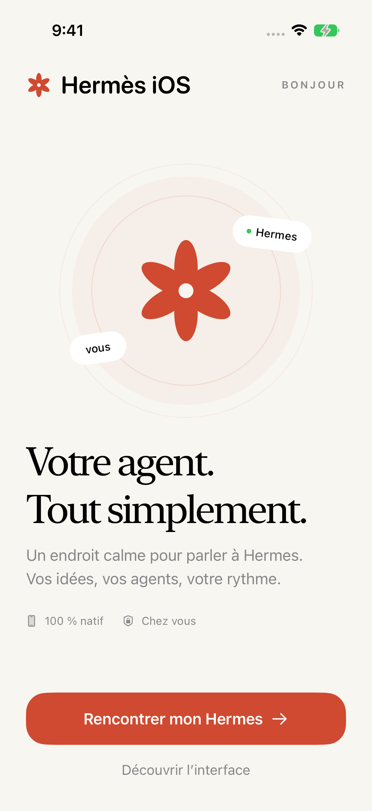
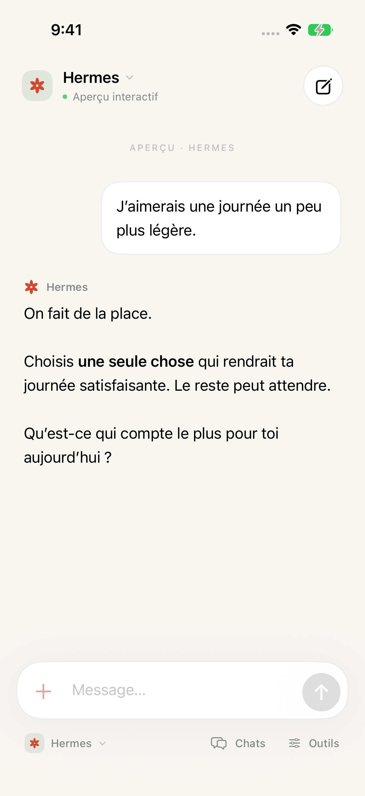
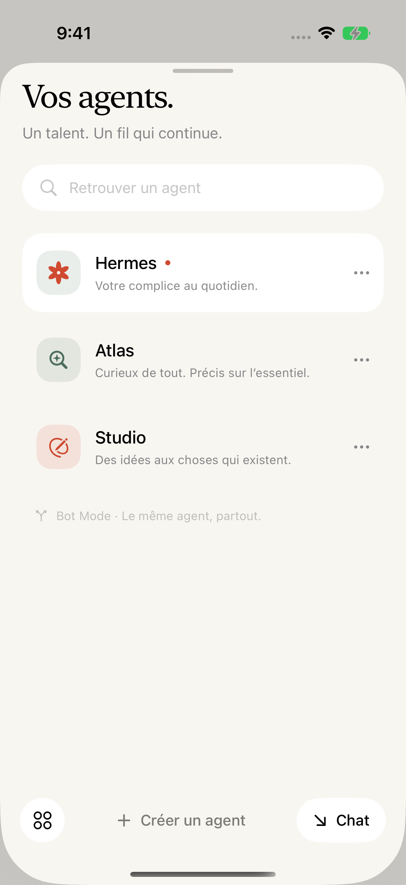

# Hermès iOS

**A quiet, native iOS home for your Hermes agent.**

Hermès iOS connects directly to [Hermes Agent](https://github.com/NousResearch/hermes-agent) by Nous Research. Your agent stays on your server; Hermès iOS gives it a small, thoughtful interface on your iPhone. Built with SwiftUI and Apple's networking frameworks. No third-party runtime dependencies, hosted relay, analytics, or Hermès iOS account.

<p>
  
  
  
</p>

## What works

- Direct connection to the official `hermes serve` backend, including Tailscale IPs, MagicDNS, HTTPS and reverse-proxy path prefixes.
- Native password authentication, session credentials in the iOS Keychain, fresh single-use WebSocket tickets, and the existing legacy session-token path.
- Streaming chat, Markdown and code blocks, copy/share, tool activity, cancellation, approvals, clarification and secret input.
- Cached conversations and per-chat drafts stay visible while reconnecting. Ordered replay deduplicates missing events. Uncertain sends are never automatically repeated.
- Multiple saved gateways and isolated Hermes profiles.
- Bot roster, existing canonical **Bot Chats**, profile creation/cloning, description and SOUL editing, and `@profile` suggestions.
- Native routines: list, create, pause and resume, delivered to the owning Bot Chat.
- Native hosted groups with 2–6 profiles on the same gateway, attributed messages, durable cursor replay, idempotent retry and stop.
- Light/dark appearance, native controls, VoiceOver labels and an offline interactive preview.

The first UI is in French. Contributions for localization are welcome.

Initial device build: approximately **3.7 MB**, unpacked and unsigned. [Validation results](docs/VALIDATION.md).

## Run

Requirements: macOS, Xcode 16 or later with a matching iOS simulator runtime, and iOS 17 or later on device. Development validation currently uses Xcode 27 / iOS 27 Simulator. The Xcode project is checked in; XcodeGen is only needed when changing its structure.

1. Clone this repository and open `HermesIOS.xcodeproj`.
2. Select the **HermesIOS** scheme and an iPhone simulator. Run.
3. Choose **Découvrir l’interface** for the offline preview, or connect your Hermes server using the [connection guide](docs/CONNECTING.md).

For an actual iPhone, select your development team in Signing & Capabilities and use your own bundle identifier. There is no App Store or TestFlight release yet.

```sh
swift test

# If you change project.yml or add source files:
brew install xcodegen
xcodegen generate

# Choose an available simulator from xcrun simctl list devices available:
xcodebuild -scheme HermesIOS -destination 'platform=iOS Simulator,name=iPhone 17 Pro' test
```

Keep simulator signing enabled when testing authentication: the Keychain needs the application entitlement. Building with `CODE_SIGNING_ALLOWED=NO` is suitable only for a compile check.

## Hermes compatibility

The initial client was researched and integration-tested against Hermes **0.21.2**, commit [`b7b35a8`](https://github.com/NousResearch/hermes-agent/commit/b7b35a84b7fbe1aa2e223a6ce726a2471300d0a4), on September 12, 2026. Hermes evolves rapidly. Hermès iOS uses native capability checks for Bot Mode, profile-scoped routines and hosted groups; an old or incompatible backend may need updating.

Hermès iOS uses `/api/ws` and Hermes' JSON-RPC methods. It does **not** reimplement Hermes behind an OpenAI-compatible chat proxy. Memory, prompts, tools, profiles, permissions, scheduled work and durable conversation history remain owned by Hermes. [Protocol research and exact methods](docs/HERMES_PROTOCOL.md).

## Honest boundaries

This is an early **0.1.0** client. OAuth/Nous Portal browser sign-in, voice, media attachments, rich tool-result panels, cross-gateway group routing and the desktop's full capabilities/settings surface are not implemented. The initial group UI supports text discussions; advanced group approval/administration remains in Hermes Desktop. Messages sent from outside Hermès iOS appear when the corresponding native session/history or group log is refreshed.

iOS suspends network work in the background. The agent keeps working on the server; Hermès iOS reconnects on return. Hermes' replay ring is finite and its transcript snapshots do not carry an atomic event cursor. Normal reconnects replay exactly; after a ring overflow, Hermès iOS rebases from history/in-flight text, retaining the known partial answer when overlap cannot be proven until the authoritative final answer arrives. “Invisible sync” is a UX objective, not a promise that an offline phone receives live tokens. See [architecture](docs/ARCHITECTURE.md).

## Contribute

Read [CONTRIBUTING.md](CONTRIBUTING.md) and [the testing guide](docs/TESTING.md). Protocol changes should include a behavioral test and evidence from the official Hermes implementation. Keep the app small. Don't add a replacement backend, a private sync service, or provider credentials to the client.

MIT licensed. Hermès iOS is an independent community project, not an official Nous Research product. Hermes Agent retains its own license and branding.
